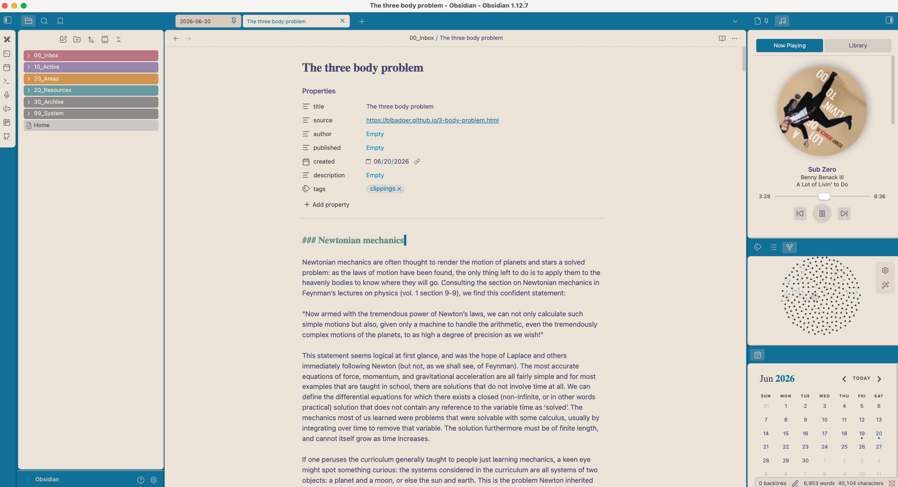

# 🎵 Navidrome Player for Obsidian



I spend hours in Obsidian and got tired of leaving my vault to skip a track on my
[Navidrome](https://www.navidrome.org/) server. So I built a little player that lives in the
sidebar, plays my library at full quality, and **spins a record while it goes**.

> **Desktop only** for now — mobile is on the list once the audio path is sorted.

## What it does

- **A spinning record** — cover art turns like vinyl while it plays, stops when you pause or not there is a square mode too. 🤷‍♂️ 
- **Browse your library** — albums grid, artists with expandable albums, playlists
- **Shuffle & vibes mode** — shuffle the queue, or let it pull random songs from your whole library
- **Two-minute setup** — server, username, password in settings, hit Test Connection, done

## Getting started

> Coming soon to the obsidian community but runs this way for now

You'll need a running Navidrome server (or anything that speaks the Subsonic API) and desktop
Obsidian.

```sh
npm install && npm run build
```

Copy `main.js`, `manifest.json`, and `styles.css` into your vault at
`<vault>/.obsidian/plugins/navidrome-player/`, then enable it in **Settings → Community plugins**.
Enter your server details in **Settings → Navidrome Player** and hit **Test connection**.

Open the player from the music icon in the ribbon, or run "Open Navidrome Player" from the command
palette. It docks in the right sidebar.

## Dev

- `npm run dev` — rebuilds `main.js` as you save
- `npm run build` — type-check (strict) + production build

The codebase is small on purpose: a thin Subsonic client (`src/subsonic.ts`), a player/queue store
(`src/player.ts`), and a sidebar view with two tabs (`src/view.ts`, `src/tabs/`). No framework.

## License

MIT
