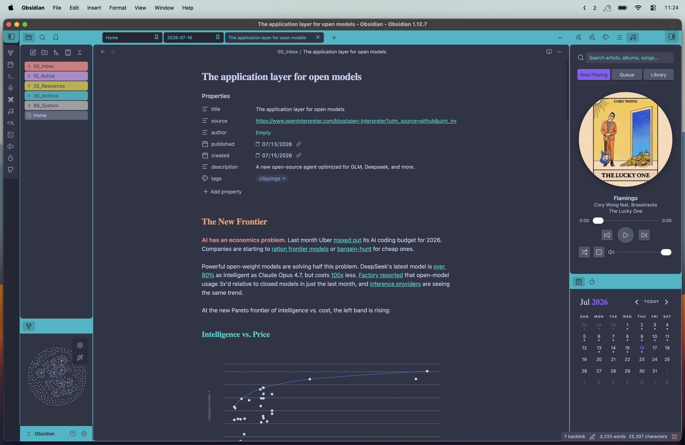

# Navidrome Player for Obsidian



I spend hours in Obsidian and got tired of leaving my vault to skip a track on my
[Navidrome](https://www.navidrome.org/) server. So I built a little player that lives in the
sidebar, plays my library at full quality, and **spins a record while it goes**. 

[Find it here](https://community.obsidian.md/plugins/navidrome-player)

> **Desktop only** for now, mobile is on the list once the audio path is sorted.

## What it does

- **A spinning record** — cover art turns like vinyl while it plays, stops when you pause. There's a square mode too. 🤷‍♂️
- **Browse your library** — albums grid, artists with expandable albums, playlists
- **Search everything** — one bar up top searches artists, albums, and songs across your library
- **Internet radio** — the stations saved on your server show up under Radio and stream live, with best-effort now-playing info
- **Shuffle & the dice** — shuffle the current queue, or roll the dice to clear it and start an endless random mix pulled from your whole library. Roll again any time to re-draw a fresh queue; the mix keeps topping itself up until you pick something specific.
- **Two-minute setup** — server, username, password in settings, hit Test Connection, done

## Installation

From within Obsidian:

1. Open **Settings → Community plugins** and make sure Restricted mode is off.
2. Click **Browse**, search for **Navidrome Player**, and click **Install**.
3. Click **Enable**.

## Getting started

You'll need a running Navidrome server (or anything that speaks the Subsonic API) and desktop
Obsidian.

Enter your server URL, username, and password in **Settings → Navidrome Player** and hit
**Test connection**.

Open the player from the music icon in the ribbon, or run "Open Navidrome Player" from the command
palette. It docks in the right sidebar.

## Manual installation

If you'd rather build it yourself, clone the repo and run:

```sh
npm install && npm run build
```

Then copy `main.js`, `manifest.json`, and `styles.css` into your vault at
`<vault>/.obsidian/plugins/navidrome-player/` and enable it in **Settings → Community plugins**.

## Network use

This plugin only connects to the Navidrome/Subsonic server you configure in settings — to
authenticate, browse your library, and stream audio — and opens short-lived connections to your
server's saved radio stream URLs to read "now playing" metadata. It sends no data to any third party
and includes no telemetry; your credentials are stored locally and only sent to your server.

## Credits

Built with the assistance of AI coding tools. Mostly documentation and UI/UX work using Claude opus 4.8

## License

MIT
